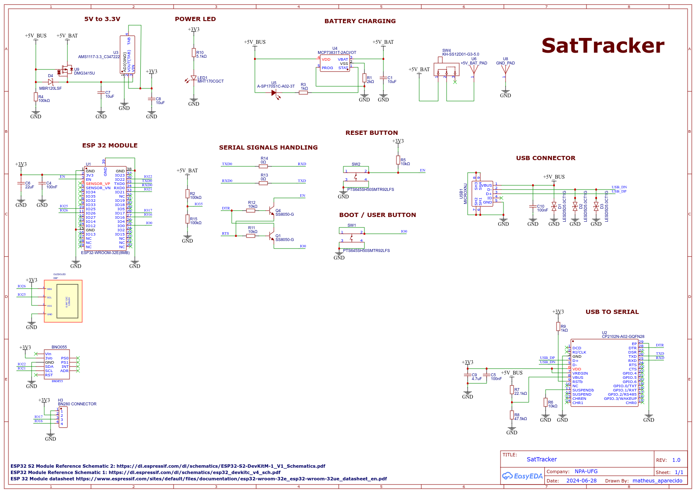

# SatTracker-Standalone

This project is a satellite tracker based on the **ESP32** that allows you to select a satellite from a predefined list and view real-time positioning information on an OLED display. It uses GPS data to calculate the current position of the selected satellite and predicts upcoming pass times.

## Table of Contents

- [Description](#description)
- [Features](#features)
- [Required Hardware](#required-hardware)
- [Required Libraries](#required-libraries)
- [Project Setup](#project-setup)
- [How to Use](#how-to-use)
- [Satellite List](#satellite-list)
- [Demo](#demo)

## Description

The project uses a GPS module to obtain the current location and time, and calculates the position of satellites using provided TLE (Two-Line Element) data. An OLED display is used to present an interactive menu where the user can select the desired satellite and view information such as azimuth, elevation, and the prediction of the next pass.

This project was specifically developed for the **ESP32** board.

## Features

- **Satellite Selection:** Navigate through a list of satellites and select the one you wish to track.
- **Real-Time Information:** Displays current time, satellite name, azimuth, elevation, and next pass prediction.
- **Interactive Interface:** Uses buttons for menu navigation and option selection.
- **OLED Display:** Presents information clearly and legibly.
- **ESP32 Compatibility:** Leverages the ESP32's resources for better performance.

## Required Hardware

- **ESP32 Dev Kit:** For main processing.
- **GPS Module (e.g., NEO-6M):** To obtain location and time data.
- **SSD1306 OLED Display (128x32 pixels):** For displaying information.
- **Navigation Buttons:**
  - **"Next" Button:** Connected to GPIO pin 25.
  - **"Previous" Button:** Connected to GPIO pin 26.
  - **"Select" Button:** Connected to GPIO pin 27.
- **Wires and Breadboard:** For electrical connections.

## Required Libraries

- **TinyGPSPlus:** For processing GPS data.
- **Sgp4:** For satellite orbit calculations.
- **Ticker:** For periodic timing.
- **Adafruit GFX Library:** Required for the OLED display to function.
- **Adafruit SSD1306:** Driver for the SSD1306 OLED display.

## Project Setup

1. **Hardware Assembly:**

   - **GPS Module Connection:**
     - **GPS RX** to **ESP32 GPIO 16 (RX2)**.
     - **GPS TX** to **ESP32 GPIO 17 (TX2)**.
   - **OLED Display Connection:**
     - **SDA** to **ESP32 GPIO 21**.
     - **SCL** to **ESP32 GPIO 22**.
   - **Button Connections:**
     - **"Next" Button** to **GPIO 25**.
     - **"Previous" Button** to **GPIO 26**.
     - **"Select" Button** to **GPIO 27**.
     - Connect the other terminal of each button to **GND**.

2. **Code Configuration:**

   - Set the desired time zone by adjusting the `timezone` variable in the code (default is `-3` for Brasília time).
   - If necessary, add or remove satellites in the `satellites` list by providing the name and corresponding TLE lines.
   - Ensure that the pins defined in the code match the physical connections of your hardware.
   - Verify that the serial communication settings are correct for your GPS module.

## How to Use

1. **Initialization:**

   - When the device is powered on, the satellite selection menu will be displayed on the OLED screen.

2. **Menu Navigation:**

   - Use the **"Next" Button** (GPIO 25) to move to the next satellite in the list.
   - Use the **"Previous" Button** (GPIO 26) to go back to the previous satellite.
   - Use the **"Select" Button** (GPIO 27) to confirm the satellite selection.

3. **Satellite Monitoring:**

   - After selecting the satellite, the screen will display:
     - Current time.
     - Satellite name.
     - Azimuth and elevation.
     - Next pass prediction.
   - To return to the selection menu, press the **"Select" Button** again.

## Satellite List

The default list of satellites included in the code is:

- NOAA 18
- NOAA 19
- NOAA 15
- METEOR M2-3
- METEOR M2-4
- METEOR M2-2
- ISS (ZARYA)
- GOES 17
- GOES 16

You can add or remove satellites by editing the `SatelliteData` structure in the code. Ensure you obtain updated TLE lines for each satellite.

Para adicionar o esquema ao README, você pode incluir o protótipo do esquemático como uma imagem. Aqui está um trecho atualizado com o esquemático:

## Schematic Prototype

Below is the current prototype of the SatTracker circuit, designed to integrate the ESP32, GPS module, OLED display, and other components:

## Demo

